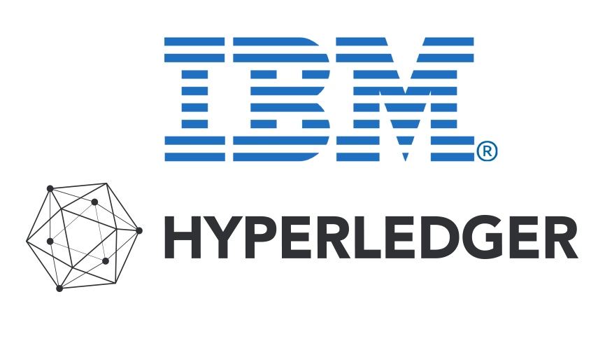
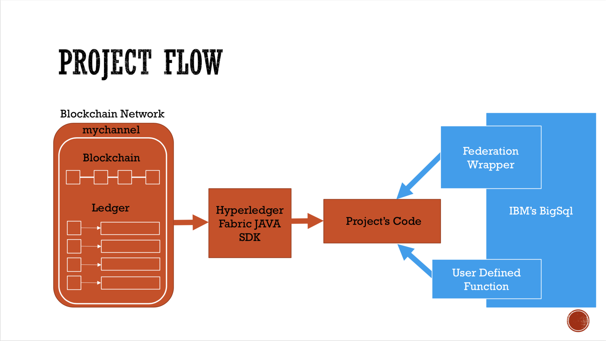

# IBM's BigSql and Blockchain Integration



## Project Overview 

### Project Summary

The problem is that nowadays many companies are now moving towards the blockchain trend and technology. Because of this, many of the employees are not able to access the data within the blockchain network due to the intense technical knowledge needed to understand how blockchain works. What we aim to do is to create a functionality that is native to IBM's BigSql allowing BigSql users who are assocated with a blockchain network to automatically connect to such network as an external database where the user can query information and peform analytics on the data. 

### Project Goal 

To create easy and fast SQL access to exisiting Hyperledger Fabric Blockchain Networks.

### Project Deliverables

1. Create and establish a connection to any Hyperledger blockchain network.
2. Query Information from both databases in blockchain network - blockchain and ledger.
3. Create a User Define Function (UDF) to query data from network in Db2.
4. Create a Federation Wrapper that encapsuales the functionality of our project's code in IBM's BigSql.
5. Use MQT's as a caching mechanism for wrapper to incrementally update the table with new information rather than querying entire blockchain everytime function is called.
6. Use User-Mapping as way to store the user's blockchain credentials internally in BigSql, so the user doesn't have to manually input it everytime.
7. **Optional**: Output/write the query function's output into a .json, .csv, .xslx file for people to use

## Blockchain Background

### IBM's Blockchain Courera Course
I would highly recommend for any IBMer who has not working technical knowledger of blockhain take IBM's blockchain course on Coursera.com. This cource will give you all the information you need and plenty more about blockchain and for this project. The course should only take a day to complete.

The link to the course:

```
https://www.coursera.org/learn/ibm-blockchain-essentials-for-developers
```

### Hyperledger Fabric
Now that you have a working knowledge of how a blockchain network works. We will dive deeper into the open source project we will be working it.The Hyperledger project is an umbrella projects of open source blockchains and related tools. The specific proejc we will be working with is the Hyperledger Fabric. This project is a blockchain framework implmentation, which we will use to create and run our blockchain applications for testing and demo uses. 

#### Sample Blockchain Application
To understand how the Fabric works, in the link below follow the instructions to set up the developer enviroment which will be the same for our project and try running the sample blockchain projects to make sure everything is up and running. 

Setting you your developer enviroment:

```
https://hyperledger-fabric.readthedocs.io/en/release-1.2/write_first_app.html

```
Sample blockchain applications provided by Hyperledger 

```
https://github.com/hyperledger/fabric-samples

```

Running sample blockcahin applications on Fabric:

```
https://hyperledger-fabric.readthedocs.io/en/release-1.2/build_network.html

```

#### Hyperledger Fabric Java SDK
With this project we will be using a the java SDK to directly connect to a network and run transactions and queries from our code. Take a look at the SDK and try to undestand the flow of it. 

```
https://github.com/hyperledger/fabric-sdk-java

```
This is a diagram of how the flow and layout of the project looks like.



## OUR PROJECT

Before we dive deep into the project's code, try and run the demo jupyter notebook that will demo what our code is capable of right now. 

```
Demo.ipynb

```
 
### Config.json
Since there is a lot of configurations and necessary credentials needed to connect to a network, we created a json file to input all the requirements as a way to save time while we work on the proejct and for testing. Later on, this will all be saved using user-mapping.

```
{
    "fabricUser":{
        "username":"admin",
         "userAffiliation":"org1",
         "userMSPID":"Org1MSP",
         "userCertFilePath":"network_resources/crypto-config/peerOrganizations/org1.example.com/users/Admin@org1.example.com/msp/admincerts",
         "userPKFilePath":"network_resources/crypto-config/peerOrganizations/org1.example.com/users/Admin@org1.example.com/msp/keystore"
    },
     "network":{
         "channelName":"mychannel",
         "IPAdress":"127.0.0.1",
         "peerName":"peer0.org1.example.com",
         "peerURLPort":"7051",
         "ordererName":"orderer.example.com",
         "ordererURLPort":"7050",
         "chaincodeName":"fabcar"
    }
}

```

 **NOTE: CONFIG.JSON HAS ALL THE RIGHT CONFIGURATIONS FOR THE BLOCKCHAIN APPLICATION IN THIS REPO AND IS IN THE RIGHT DIRECTORY. DO NOT CHANGE THIS UNLESS U CHANGE SOMETHING IN THE BLOCKCHAIN APPLICATION ITSELF!**
 
### Running Our Code 
Now that you have tried to demo and and understand blockchain, we will go through the steps necessary to run our code. If you want more information about the specifics of the code, please read the read.me under the `wrapper/` directory which is the directory where our code is located. 

#### Step 1: Set-Up Blockchain Application
First, we need to change directory into the blockchain application and then run the bash script that will set up the blockchain network and create a channel of us. (This will take a couple of minutes.)

```
cd blockchain-marblebank-application/
sh blockchain-setup.sh
```

#### Step 2: Set-Up Project's Code 

We now have to change directory into our projects code and run the bash script that will package the code and insert the the jar file under the main directory folder- "bigsql-fabric". (Transactions.java will take a couple of minutes.)

```
cd ../wrapper
sh fabric-setup.sh
```
Now we will need to prepopulated the blockchain network with transactions, so we can test our code's query functions. (Transactions.java will take a couple of minutes.)

```
java -cp blockchain-fabric.jar com.ibm.federation.fabric.Transactions config.json
```

#### Step 3: Query From Blockchain
Everything is now set-up and ready. We will first query from the blockchain, which holds all the transaction history in order, functions invoke, parameters and other transaction related information. We will run three commands which will output three tables representing different types of information. 

```
//table 1 shows hashes of the block
java -cp blockchain-fabric.jar com.ibm.federation.fabric.QueryBlockchainTable1 config.json

//table 2 shows the function invoked for each transaction
java -cp blockchain-fabric.jar com.ibm.federation.fabric.QueryBlockchainTable2 config.json

//table 2 shows the paramaters sent for each function invoked for each transaction
java -cp blockchain-fabric.jar com.ibm.federation.fabric.QueryBlockchainTable3 config.json
```
#### Step 4: Query From World of State
We will now query from the World of State also called the Ledger. This database stores the current state of all the assets in the blockchain network. 

```
//Query 1 queries an individual account
java -cp blockchain-fabric.jar com.ibm.federation.fabric.QueryLedger1 config.json

//Query 2 queries account history for a specific account
java -cp blockchain-fabric.jar com.ibm.federation.fabric.QueryLedger2 config.json

//Query 3 queries all the assests from the ledger
java -cp blockchain-fabric.jar com.ibm.federation.fabric.QueryLedger3 config.json
```


  

 


